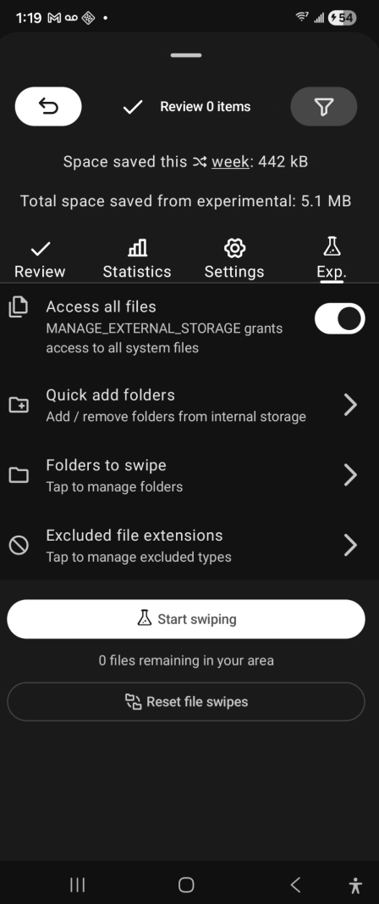
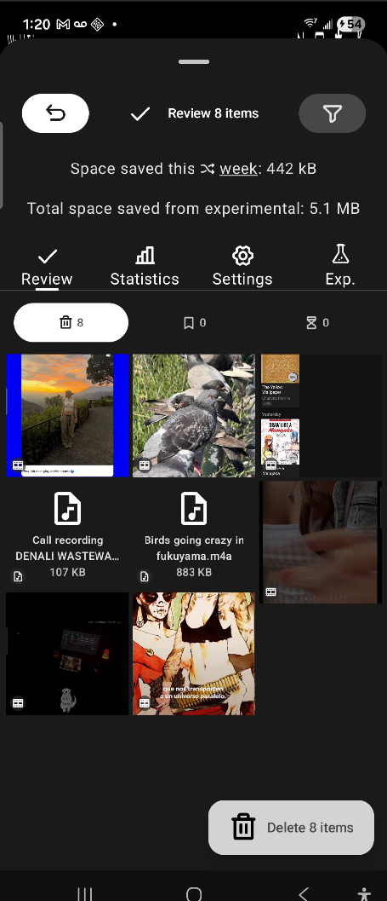
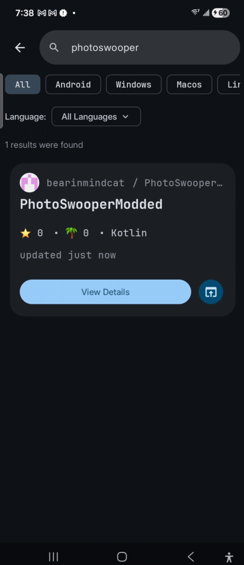

# PhotoSwooper + Experimental Features

All original credits go to the owner here https://codeberg.org/Loowiz/PhotoSwooper ; I was inspired to add functionality to swipe on all system file types as well from the reddit thread here https://www.reddit.com/r/fossdroid/comments/1r4jbkt/is_there_a_tinderstyle_swipe_app_just_like/ ; though I'll try to keep up with updates to the original, I wouldn't count on it unless someone PMs be about functionality of the app breaking.

**Link to releases:** [https://gitlab.com/bearincrypto1/photoswoopermodded/-/releases](https://gitlab.com/bearincrypto1/photoswoopermodded/-/releases)

## Get from source

```bash
git clone https://gitlab.com/bearincrypto1/photoswoopermodded.git
```

## Modded Code

```
com.example.photoswooper/
└── experimental/                              # all experimental specific code in here, take a look!
    └── thingstopotentiallyadd.md              # things I might add in the future
```

## Things too be aware of...

All media files will go to trash, all non-media file types will go straight to "permanent delete." There's currently no android api like what this app uses with "MediaStore" for other non-media files so those "other types" will just be permanently deleted.

Experimental swiping is seperate from the main media swiping feature on the app, you will have to press "Start Swiping" and vice-verse "Stop Swiping" to get to/from the experimental swiping area for all system files.

For experimental swiping for "all system files" you need to enable the "MANAGE_EXTERNAL_STORAGE" slide permission and you have to manually add folders to be scanned for swiping. Note that sub-folders inside of any folder you select will be part of the scan as well, but if you want to narrow your scope in you can manually select folders outside of the "quick add folders" that just lists all the folders from the internal storage.

## Screenshots

| Experimental Tab | Review Screen |
|---|---|
|  |  |

| Github store screenshot |
|---|
|  |

## License

This project is licensed under the AGPL-3.0 License - see the [LICENSE](LICENSE) file for details.

## Credits

Based on [PhotoSwooper](https://codeberg.org/Loowiz/PhotoSwooper) by Loowiz.
