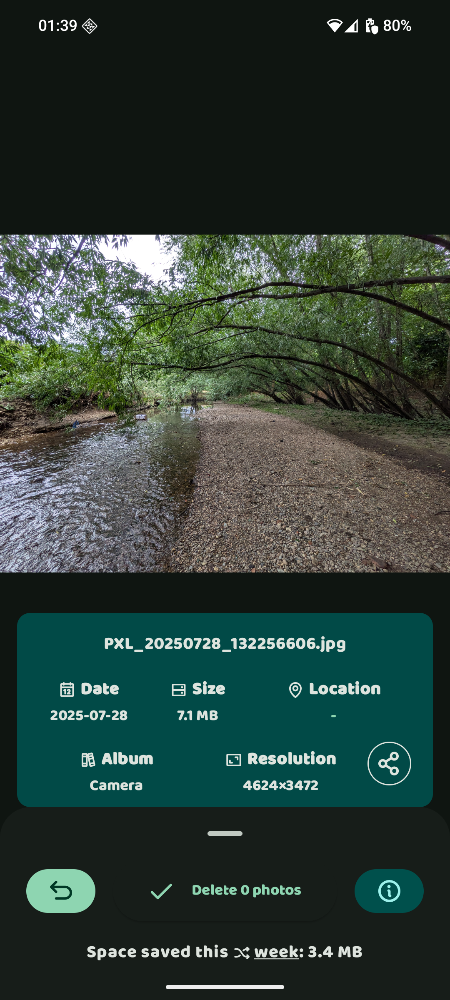
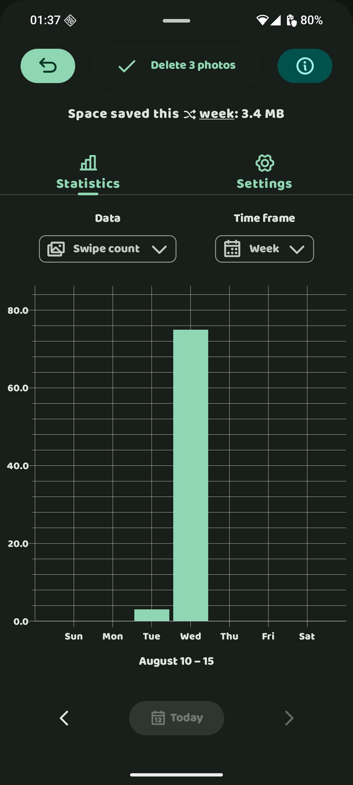
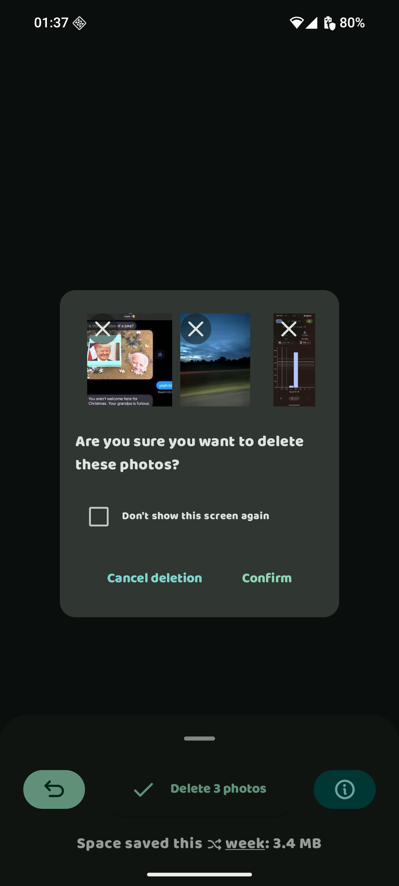

# PhotoSwooper
[)](LICENSE)

[![IzzySoft version number](https://img.shields.io/endpoint?url=https://apt.izzysoft.de/fdroid/api/v1/shield/com.example.photoswooper&logo=data:image/png;base64,iVBORw0KGgoAAAANSUhEUgAAADAAAAAwCAMAAABg3Am1AAADAFBMVEUA0////wAA0v8A0v8A0////wD//wAFz/QA0/8A0/8A0/8A0/8A0v///wAA0/8A0/8A0/8A0/8A0//8/gEA0/8A0/8B0/4A0/8A0/8A0/+j5QGAwwIA0//C9yEA0/8A0/8A0/8A0/8A0/8A0/+n4SAA0/8A0/8A0/+o6gCw3lKt7QCv5SC+422b3wC19AC36zAA0/+d1yMA0/8A0/+W2gEA0/+w8ACz8gCKzgG7+QC+9CFLfwkA0/8A0////wAA0/8A0/8A0/8A0/+f2xym3iuHxCGq5BoA1P+m2joI0vONyiCz3mLO7oYA0/8M1Piq3Ei78CbB8EPe8LLj9Ly751G77zWQ1AC96UYC0fi37CL//wAA0/8A0////wD//wCp3jcA0/+j3SGj2i/I72Sx4zHE8FLB8zak1kYeycDI6nRl3qEA0/7V7psA0v6WzTa95mGi2RvB5XkPy9zH5YJ3uwGV1yxVihRLiwdxtQ1ZkAf//wD//wD//wD//wD//wCn5gf//wD//wD//wD//wD//wAA0/+h4A3R6p8A0/+X1w565OD6/ARg237n9csz2vPz+gNt37V/vifO8HW68B/L6ZOCwxXY8KRQsWRzhExAtG/E612a1Rd/pTBpmR9qjysduKVhmxF9mTY51aUozK+CsDSA52T//wD//wAA0////wD//wBJ1JRRxFWjzlxDyXRc0pGT1wCG0CWB3VGUzSTh8h6c0TSr5CCJ5FFxvl6s4H3m8xML0/DA5CvK51EX1N+Y2gSt4Dag3ChE3fax2ki68yO57NF10FRZnUPl88eJxhuCxgCz5EOLwEGf1DFutmahzGW98x0W1PGk3R154MHE6bOn69qv3gy92oG90o+Hn07B7rhCmiyMwECv1nO+0pQfwrCo57xF2daXsVhKrEdenQAduaee1Bsjr42z5D9RoCXy+QNovXpy2Z5MtWDO/TiSukaF3UtE1K6j3B4YwLc5wXlzpyIK0u5zy3uJqg4pu5RTpkZmpVKyAP8A0wBHcExHcEyBUSeEAAABAHRSTlP///9F9wjAAxD7FCEGzBjd08QyEL39abMd6///8P/ZWAnipIv/cC6B//7////////L/1Dz/0D///////86/vYnquY3/v///5T//v///17///////////////84S3QNB/8L/////////////7r/////NP////9l/////wPD4yis/x7Ym2lWSP+em////0n////////v///////////////////7//7pdGN3Urr6/+v/6aT////+//H/o2P/1v+7r7jp4PM/3p4g////g///K///481LxO///v////9w////8v/////9/p3J///a+P9v/5KR/+n///+p/xf//8P//wAAe7FyaAAABCZJREFUSMdj+E8iYKBUgwIHnwQ3N7cEHxcH+///VayoAE0Dh41qR7aBnCIQ8MsJKHH9/99czYYMWlA0cIkJGjMgAKfq//9RNYzIgLcBWYOTiCgDMhDn+B9bh6LebiWyH6L5UZQzONoAHWSHoqEpDkkDsyKqelv1//9rG1HUN9YihZK9AKp6BkG+/6xNqA5ajhSsCkrIipmYGGRa//9vQXVQXSySBnkWJOUMfn5Myuz/G3hR1NdEIUUchwiy+bkTsg4dbW/fu6W/e1c3XMMy5JiOZkFxUFZo74mgKTqaKXu0+2HqVwkja3BH9kFu361JwcHTfPJD4mdfe8ULAdVRyGlJAcVFfg+CQOozZ4XrJ85+JgwBsVXIGriQw5Tp4ZScezd8JiWnBupru30qwJZa+ZAjmWlC8fUZM4qB6kPnLNSPLMWqQQ5ZQ5aOzs1HmamBaQHzFs6y+qAmJCTE8f9/QgKSBg4DJPWc6zVDQkIC09JkZSPD38kukpExFpT4z67uYI/QwCOOCCK/izvu5CWl6AcEWMnKWml7LWbKZfH9/99UkknQHhGsynDz+65eWXv3/JmJrq5eXienVlRUfH/z8VvCf45soKQIH1yDEQsszrp6gwq9C73T87xcXadKl5TkFev4A/2tygmSBqYXqAYJmK+ZuoJydDR1vP09DA0NOy2kpdML81+U/heCpH1JU3jig7lJ5nKOT4i/t6ZHkqGzs4lJmIVHfrj+JR4HqLQSD0yDkCNEpGNn5ix9D03/eJdElTZdKV2TpNOhkwt8YUlNUgimgV0dLMBvf1gz1MolPd5FRcVNSkpDQ8owJeBCDyIhrIDnOD5QcuIU+3/2QKSs9laQ+noNLS0zLWdtqyP7mBAFAw88TwsJgMuJYweBGjYngtWbmeuZOW+bvNQToUFOAlFqOBk4Ov3/L7Z60/aN0p1tUhpa5nqWlub7C3p2I9QzyAghlUvczOz/1fhzPT3XSIfpSmmYAdVbmm1gV0dSz8DSilpUQsqCddIWIA3meuZaJqdMJZEzl6gRqgZIWZAxUdoizERXN8yi5MltcZTChzMaRQM3JNUWHS8rL/+yaPGvMmvr5ywoGoxtkDWwQ+Pb89ycBeWfGSJeL/la+RS1eOPnRtbQKgMRjZg+t8x6PkP273nWQAoFOPAgaeAThKXAmXMrK39Kmr5fsuBlBqoXfJGLe3VbmHjG9Mczi9T//3h7vygXtcDlQtJg44iQiIjIBRbGPO7gghPJy0ZIxT2HOLIUgwxQzsgYrUR350HSIMaJLidhgKY+mw+pflBDrX8E7OGBjPCAPc76gQFSTqAIiYrb/8dRP4CyosJ/rmwU5XIxHMilt4QBJwsSkBMClxOQULBlkRRwEONmR2kJcDGjADX2/+xO8r5iqjExqmLyrWpcPFRta1BfAwCtyN3XpuJ4RgAAAABJRU5ErkJggg==)](https://apt.izzysoft.de/fdroid/index/apk/com.example.photoswooper)

</a>

A dating app for ur photos <3

Have you ever had too many photos and would just love to swipe them like dating profiles?

Well I made just the app: PhotoSwooper :D

Hope you enjoy!

## Features

> Features last updated 2025-07-28

- [X] Undo button
- [X] Info drawer
- [X] Review photos to be deleted
- [X] Statistics page
- [x] Settings page
- [x] No ads, forever!

## Screenshots

> Screenshots as of 2025-07-28

## Issues

If you would like to report a bug or request a feature, you may do so via the issues section of this git page or via
any contact method listed on [my website](https://loowiz.envs.net).

## Legal

Please read LICENSE file (idk what else to add here lol legal just sounds fancy so I wanted to add it)